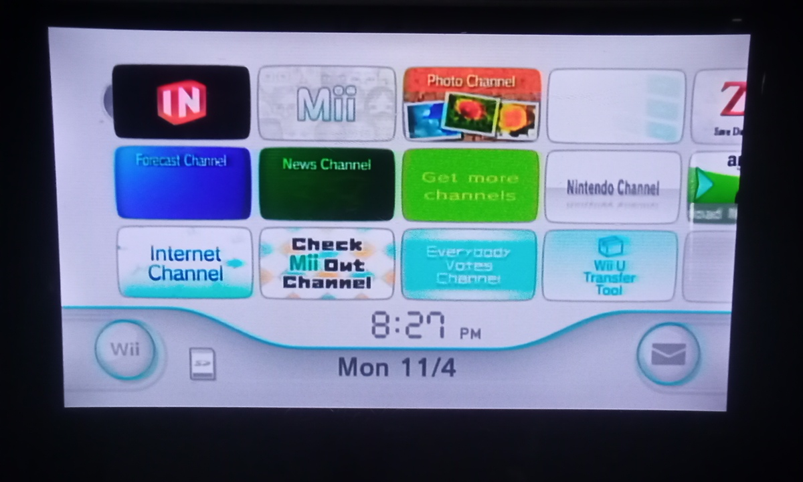

Estoy pensando en hacer el portafolio con un estilo de menu de nintendo Wii, con las siguientes secciones:

Selector de canales

              - Sobre mí
              - Habilidades (posiblemente fusionarlo con stack ténico)
              - stack técnico 
              - Experiencia laboral 
              - Proyectos 
              - Educación 
              - Contactos
configuración

APARTE UN BOTÓN SWITCH PARA DESABILITAR LA MUSICA
#selector de temas (claro/oscuro)
#En esta parte pretendo que alla un tipo de configuración de la web, en musica Lo-fi.
#volumenes de la música
#configuración de fuentes y textos

  Hora y fecha (entre medio)
Correo o mensaje

#Una parte de mensajes enviados por mi ala página
(todavia no se de que xd)

