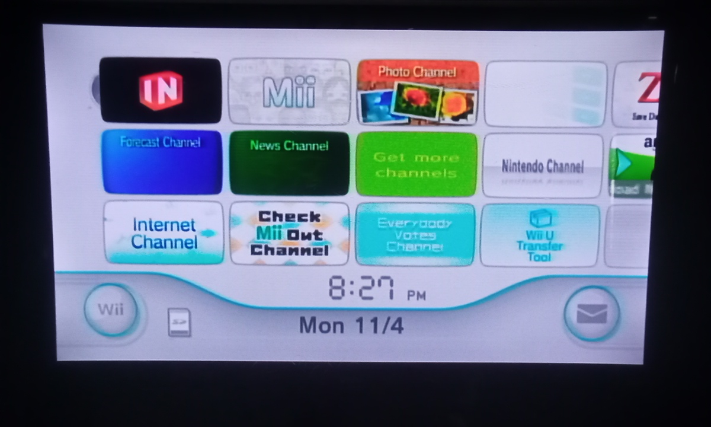

# Portafolio — Enmanuel Reynoso Salazar

Portafolio personal interactivo con la interfaz del menú de canales de la Nintendo Wii.
Cada sección es un canal: se navega desde una rejilla, con reloj, música de fondo
opcional y temas claro/oscuro.

**En vivo:** _(pendiente de publicar)_



## Sobre el perfil

Tecnología hotelera e ingeniería de software: operación diaria sobre PMS
(Cloudbeds, Hotello), auditoría nocturna y motores de reserva, más desarrollo de
producto — fundador de [AsistoYA](https://asistoya.com), 3er lugar nacional en el
concurso de emprendimiento del MESCyT 2025.

## Stack

| Área | Tecnologías |
| --- | --- |
| Framework | React 19, TypeScript, Vite 7 |
| Rutas | React Router 7 |
| Estilos | CSS con custom properties (temas claro/oscuro) |
| Iconos | lucide-react |
| Audio | react-player |

Sin librería de UI ni de estilos: el sistema de diseño (superficies, elevación,
brillo, radios) vive en custom properties de CSS en `src/App.css`.

## Arrancar en local

```bash
npm install
npm run dev      # servidor de desarrollo
npm run build    # compila a dist/
npm run preview  # sirve el build
npm run lint     # ESLint
```

Requiere Node 20 o superior.

## Estructura

```
src/
├── components/
│   ├── layout/      PageShell, ChannelGrid, BottomBar, IntroScreen
│   └── ui/          ChannelTile, ToggleSwitch, VolumeSlider, ImageLightbox…
├── context/         AudioContext, ThemeContext
├── data/
│   ├── portfolio.ts Todo el contenido del portafolio (fuente única)
│   └── channels.tsx Definición de los canales del menú
├── hooks/           useClock, useLocalStorage
├── pages/           Una página por canal + pages.css compartido
└── types/           Tipos del dominio
```

### Dónde se edita el contenido

Todo el contenido vive en `src/data/portfolio.ts`: experiencia, proyectos,
educación, certificaciones, idiomas, recomendaciones y contacto. Las páginas solo
lo renderizan, así que para actualizar el portafolio normalmente basta con tocar
ese archivo.

Los escaneos de certificados y cartas van en `public/certificados/`, y se
referencian desde `portfolio.ts` con el campo `imagen`.

El CV en PDF está en `public/CV-Enmanuel-Reynoso.pdf` y se genera a partir de
`cv/CV-Enmanuel-Reynoso.html` (abrir en el navegador e imprimir a PDF, A4).

## Detalles de implementación

- **Temas:** `data-theme` en `<html>`, con dos bloques de custom properties en
  `src/App.css`. Nada de colores fijos en los componentes.
- **Intro:** las tres pantallas de bienvenida se recuerdan por sesión
  (`sessionStorage`), para no repetirlas a quien abre un enlace directo.
- **Animaciones:** la entrada escalonada de las tarjetas va por `nth-child` en
  CSS, y todo se desactiva bajo `prefers-reduced-motion`.

## Licencia

Código disponible como referencia. El contenido personal, las imágenes y los
certificados no son reutilizables.
